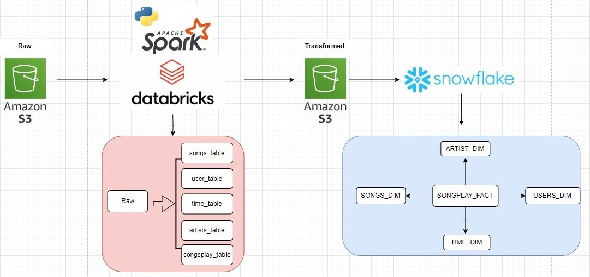

# Sparkify Mini Project
#### Ginamarie Mastrorilli
---
## Reference Architecture Diagram


---
## Sparkify's use of Data Lake & Data Warehouse
Sparkify can leverage the AWS S3 Data Lake by extracting the raw data from a bucket on S3. AWS S3 is a cost-effective and scalable data storage option for a startup company. Sparkify can also leverage S3 as a staging area after the raw data has been transformed in Databricks but before migrating to Snowflake. Even though Sparkify could store data in Databricks and connect to Snowflake, the more cost-effective option, which does not add a significant workload, is to stage the data in S3 and then connect to Snowflake. 

Sparkify should use the Data Warehouse Snowflake as their new data host because it is a cloud based data warehouse that is scalable and provides analytical capabilities. As a startup, Snowflake is a good option becuase of the built in security and because it is a Software as a Service. Even though Snowflake is costly, it will save on significant IT investments and provides complete data warehousing solutions. 


---
## Database Schema & ETL Pipeline
The ETL pipeline starts by extracting raw data from Amazon S3. Using Databricks, Spark allows us to read JSON files directly from the public S3 bucket. Once this raw data has been validated, the pipeline continues onto transforming the data. Within Databricks, the raw data is processed into five new tables (songs_table, user_table, time_table, artists_table and songplays_table). This transformed data is written back to S3 in a new bucket. This data is then loaded into Snowflake in their respective tables.

The final database schema for Sparkify is a star schema within Snowflake. This schema optimizes performance by simplifying queries, controlling data redundancy, simplifying ETL processes, and being a scalable option. The structure of the star schema allows users to easily join the fact table with the dimension tables using primary key and foreign key relationships. This structure is also extremely scalable because adding new dimension tables is an easy way to support growing data. In any database there is bound to be data redundancy, but with a star schema the redundancy is controlled and purposeful. 


---
## Overall Process

The first step in this mini project for Sparkify is to ingest the data. Using databricks/Spark, I read the song data and log data files from AWS S3. Validation checks such as printing the schema, counting rows, and displaying the files read were performed to ensure accurate data ingestion. 

Next, I processed the song data (df) to create the SONGS_DIM and ARTISTS_DIM table logic. To create songs_table, I extracted the following columns: "song_id", "title", "artist_id", "year", "duration". Then, I wrote the table songs_table to S3 as a parquet file. This table will be referneced when creating the SONGS_DIM table in Snowflake. I completed the same process for the artists_table which will be referenced when creating the ARTISTS_DIM table, but I extracted the following columns instead: "artist_id", "artist_name", "artist_location", "artist_latitude", "artist_longitude".

After processing the song data (df), I then processed the log data (df_log). I began with an intial transformation to create the column 'datetime'. This column transforms the column 'ts' from epoch time to a datetime with the format 'yyyy-MM-dd HH:mm:ss'. Then, I created the users_table by extracting the following columns from the log data (df_log): "userID", "firstName", "lastName", "gender", "level". This table was writen to S3 as a parquet file, and will be used as a reference when creating the USERS_DIM table in Snowflake.

The creation of time_table also occured during the processing of the log data. To create this table, I used the created column 'datetime' along with Spark functions to create the desired columns. The columns created are "ts", "datetime", "start_time", "year", "month", "dayofmonth", and "weekofyear". Similar to the other dimension tables, I wrote time_table to S3 as a parquet file and this will be used when creating the TIME_DIM table in Snowflake. 

The final table created in databricks/Spark is the songplays_table. This table relies first on a join between the song data (df) and log data (df_log). I used a right join from df to df_log on the duration column from df and the length column from df_log. Since there was no matching ID column, I assumed duration/length would be the next best option because probabilty that any two songs have the exact same length is very low. I then created a new column 'songplay_id' by assigning a unique value to each row in this table. Next, I filtered the column 'page' to only show the value 'NextSong'. Finally, the songplays_table was created by selecting the following columns: "songplay_id", "ts", "year", "month", "userID",  "level", "song_id", "artist_id", "sessionID", "userAgent".

Now that all of the transformed data is in the S3 staging area, I moved to migrating the data from S3 to Snowflake. I first created an external stage (GM_STAGE) to establish a relationship between Snowflake to the S3 bucket. I also created a new file format (GMASTRORILLI_parquet_format) to successfully read in the parquet files. Finally, I used the Snowflake DDL scripts (below) to create the tables in snowflake that follow a star schema.

---
## Snowflake DDL Scripts

The transformed data found in S3 is located in the Bucket: 'techcatalyst-public/dw_stage/gina/'

#### 1. Create External Stage & File Format

```sql
-- creating external stage to the S3 bucket
CREATE OR REPLACE STAGE TECHCATALYST_DE.EXTERNAL_STAGE.GM_STAGE
    STORAGE_INTEGRATION = s3_int
    URL='s3://techcatalyst-public';

-- creating a parquet file format to read the data
CREATE OR REPLACE FILE FORMAT GMASTRORILLI_parquet_format
TYPE = 'PARQUET';
```
#### 2. Creating the SONG_DIM Table

```sql
-- check the songs_table schema in S3
SELECT *
FROM TABLE(
 INFER_SCHEMA(LOCATION=>'@TECHCATALYST_DE.EXTERNAL_STAGE.GM_STAGE/dw_stage/gina/songs_table/',
 FILE_FORMAT=>'GMASTRORILLI_parquet_format'));

-- create the songs_dim table 
CREATE OR REPLACE TRANSIENT TABLE TECHCATALYST_DE.GMASTRORILLI.SONGS_DIM (
    SONG_ID STRING,
    TITLE STRING,
    YEAR NUMBER,
    ARTIST_ID STRING,
    DURATION FLOAT
);

-- insert data into songs_dim
INSERT INTO TECHCATALYST_DE.GMASTRORILLI.SONGS_DIM (SONG_ID, TITLE, YEAR, ARTIST_ID, DURATION)
SELECT
    $1:song_id::STRING AS SONG_ID,
    $1:title::STRING AS TITLE,
    REGEXP_SUBSTR(METADATA$FILENAME, 'year=(\\d+)', 1, 1, 'e')::NUMBER AS YEAR,
    REGEXP_SUBSTR(METADATA$FILENAME, 'artist_id=([^/]+)', 1, 1, 'e')::STRING AS ARTIST_ID,
    $1:duration::FLOAT AS DURATION
FROM @TECHCATALYST_DE.EXTERNAL_STAGE.GM_STAGE/dw_stage/gina/songs_table/ (FILE_FORMAT => 'GMASTRORILLI_parquet_format', PATTERN => '.*parquet.*');

-- check the data has been inserted correctly
SELECT *
FROM TECHCATALYST_DE.GMASTRORILLI.SONGS_DIM;
```

#### Creating USERS_DIM Table

```sql
-- check the user_table schema in S3
SELECT *
FROM TABLE(
 INFER_SCHEMA(
   LOCATION=>'@TECHCATALYST_DE.EXTERNAL_STAGE.GM_STAGE/dw_stage/gina/user_table/',
   FILE_FORMAT=>'GMASTRORILLI_parquet_format'));

-- create USERS_DIM
CREATE TRANSIENT TABLE TECHCATALYST_DE.GMASTRORILLI.USERS_DIM (
    ID VARCHAR,
    FIRSTNAME VARCHAR,
    LASTNAME VARCHAR,
    GENDER VARCHAR,
    LEVEL VARCHAR
);

-- insert data into USERS_DIM
COPY INTO TECHCATALYST_DE.GMASTRORILLI.USERS_DIM
FROM @TECHCATALYST_DE.EXTERNAL_STAGE.GM_STAGE/dw_stage/gina/user_table/
PATTERN = '.*parquet.*'
FILE_FORMAT = 'GMASTRORILLI_parquet_format'
ON_ERROR = CONTINUE
MATCH_BY_COLUMN_NAME = CASE_INSENSITIVE;

-- check USERS_DIM data was inserted correctly 
SELECT *
FROM TECHCATALYST_DE.GMASTRORILLI.USERS_DIM;
```

#### Creating ARTISTS_DIM Table

```sql
-- check schema from S3 artists_table
SELECT *
FROM TABLE(
 INFER_SCHEMA(
   LOCATION=>'@TECHCATALYST_DE.EXTERNAL_STAGE.GM_STAGE/dw_stage/gina/artists_table/',
   FILE_FORMAT=>'GMASTRORILLI_parquet_format'));

-- create ARTISTS_DIM Table
CREATE OR REPLACE TRANSIENT TABLE TECHCATALYST_DE.GMASTRORILLI.ARTISTS_DIM (
    ARTIST_ID VARCHAR,
    ARTIST_NAME VARCHAR,
    ARTIST_LOCATION VARCHAR,
    ARTIST_LATITUDE FLOAT,
    ARTIST_LONGITUDE FLOAT
);

-- copy data from S3 artists_table into ARTISTS_DIM
COPY INTO TECHCATALYST_DE.GMASTRORILLI.ARTISTS_DIM
FROM @TECHCATALYST_DE.EXTERNAL_STAGE.GM_STAGE/dw_stage/gina/artists_table/
PATTERN = '.*parquet.*'
FILE_FORMAT = 'GMASTRORILLI_parquet_format'
ON_ERROR = CONTINUE
MATCH_BY_COLUMN_NAME = CASE_INSENSITIVE;

-- check 
SELECT *
FROM TECHCATALYST_DE.GMASTRORILLI.ARTISTS_DIM;

```

#### Creating TIME_DIM Table

```sql
-- check schema for S3 time_table
SELECT *
FROM TABLE(
 INFER_SCHEMA(LOCATION=>'@TECHCATALYST_DE.EXTERNAL_STAGE.GM_STAGE/dw_stage/gina/time_table/',
 FILE_FORMAT=>'GMASTRORILLI_parquet_format'));


-- create TIME_DIM
CREATE OR REPLACE TRANSIENT TABLE TECHCATALYST_DE.GMASTRORILLI.TIME_DIM (
    TS STRING,
    DATETIME DATETIME,
    START_TIME TIME,
    YEAR NUMBER,
    MONTH NUMBER,
    DAY_OF_MONTH NUMBER,
    WEEK_OF_YEAR NUMBER
);

-- insert data from S3 time_table into TIME_TABLE
INSERT INTO TECHCATALYST_DE.GMASTRORILLI.TIME_DIM (TS, DATETIME, START_TIME, YEAR, MONTH, DAY_OF_MONTH, WEEK_OF_YEAR)
SELECT
    $1:ts::STRING AS TS,
    $1:datetime::DATETIME AS DATETIME,
    $1:start_time::TIME AS START_TIME,
    REGEXP_SUBSTR(METADATA$FILENAME, 'year=(\\d+)', 1, 1, 'e')::NUMBER AS YEAR,
    REGEXP_SUBSTR(METADATA$FILENAME, 'month=([^/]+)', 1, 1, 'e')::NUMBER AS MONTH,
    $1:dayofmonth::NUMBER AS DAY_OF_MONTH,
    $1:weekofyear::NUMBER AS WEEK_OF_YEAR
FROM @TECHCATALYST_DE.EXTERNAL_STAGE.GM_STAGE/dw_stage/gina/time_table/ (FILE_FORMAT => 'GMASTRORILLI_parquet_format', PATTERN => '.*parquet.*');

--check
SELECT *
FROM TECHCATALYST_DE.GMASTRORILLI.TIME_DIM;
```

#### Create SONGPLAYS_FACT
```sql
-- check songplays_table in S3
SELECT *
FROM TABLE(
 INFER_SCHEMA(
   LOCATION=>'@TECHCATALYST_DE.EXTERNAL_STAGE.GM_STAGE/dw_stage/gina/songplays_table/',
   FILE_FORMAT=>'GMASTRORILLI_parquet_format'));

-- create SONGPLAYS_FACT
CREATE OR REPLACE TRANSIENT TABLE TECHCATALYST_DE.GMASTRORILLI.SONGPLAYS_FACT (
    SONGPLAY_ID NUMBER,
    DATETIME_ID STRING,
    USER_ID VARCHAR,
    LEVEL STRING,
    SONG_ID STRING,
    ARTIST_ID STRING,
    SESSION_ID NUMBER,
    LOCATION STRING,
    USER_AGENT STRING
);

-- copy data from songplays_table into SONGPLAYS_FACT
COPY INTO TECHCATALYST_DE.GMASTRORILLI.SONGPLAYS_FACT
FROM @TECHCATALYST_DE.EXTERNAL_STAGE.GM_STAGE/dw_stage/gina/songplays_table/
PATTERN = '.*parquet.*'
FILE_FORMAT = 'GMASTRORILLI_parquet_format'
ON_ERROR = CONTINUE
MATCH_BY_COLUMN_NAME = CASE_INSENSITIVE;

-- check 
SELECT *
FROM TECHCATALYST_DE.GMASTRORILLI.SONGPLAYS_FACT;
```