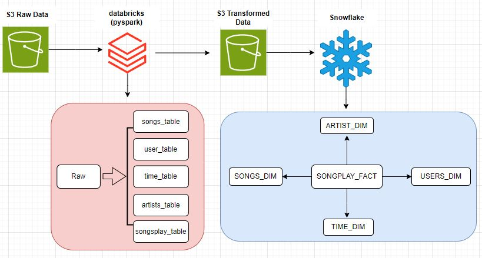

# Sparkify Mini Project
#### Ginamarie Mastrorilli
---
## Snowflake DDL Scripts

The transformed data found in S3 is located in the Bucket: 'techcatalyst-public/dw_stage/gina/'

#### 1. Create External Stage & File Format

```sql
-- creating external stage to the S3 bucket
CREATE OR REPLACE STAGE TECHCATALYST_DE.EXTERNAL_STAGE.GM_STAGE
    STORAGE_INTEGRATION = s3_int
    URL='s3://techcatalyst-public';

-- creating a parquet file format to read the data
CREATE OR REPLACE FILE FORMAT GMASTRORILLI_parquet_format
TYPE = 'PARQUET';
```
#### 2. Creating the SONG_DIM Table

```sql
-- check the songs_table schema in S3
SELECT *
FROM TABLE(
 INFER_SCHEMA(LOCATION=>'@TECHCATALYST_DE.EXTERNAL_STAGE.GM_STAGE/dw_stage/gina/songs_table/',
 FILE_FORMAT=>'GMASTRORILLI_parquet_format'));

-- create the songs_dim table 
CREATE OR REPLACE TRANSIENT TABLE TECHCATALYST_DE.GMASTRORILLI.SONGS_DIM (
    SONG_ID STRING,
    TITLE STRING,
    YEAR NUMBER,
    ARTIST_ID STRING,
    DURATION FLOAT
);

-- insert data into songs_dim
INSERT INTO TECHCATALYST_DE.GMASTRORILLI.SONGS_DIM (SONG_ID, TITLE, YEAR, ARTIST_ID, DURATION)
SELECT
    $1:song_id::STRING AS SONG_ID,
    $1:title::STRING AS TITLE,
    REGEXP_SUBSTR(METADATA$FILENAME, 'year=(\\d+)', 1, 1, 'e')::NUMBER AS YEAR,
    REGEXP_SUBSTR(METADATA$FILENAME, 'artist_id=([^/]+)', 1, 1, 'e')::STRING AS ARTIST_ID,
    $1:duration::FLOAT AS DURATION
FROM @TECHCATALYST_DE.EXTERNAL_STAGE.GM_STAGE/dw_stage/gina/songs_table/ (FILE_FORMAT => 'GMASTRORILLI_parquet_format', PATTERN => '.*parquet.*');

-- check the data has been inserted correctly
SELECT *
FROM TECHCATALYST_DE.GMASTRORILLI.SONGS_DIM;
```

#### Creating USERS_DIM Table

```sql
-- check the user_table schema in S3
SELECT *
FROM TABLE(
 INFER_SCHEMA(
   LOCATION=>'@TECHCATALYST_DE.EXTERNAL_STAGE.GM_STAGE/dw_stage/gina/user_table/',
   FILE_FORMAT=>'GMASTRORILLI_parquet_format'));

-- create USERS_DIM
CREATE TRANSIENT TABLE TECHCATALYST_DE.GMASTRORILLI.USERS_DIM (
    ID VARCHAR,
    FIRSTNAME VARCHAR,
    LASTNAME VARCHAR,
    GENDER VARCHAR,
    LEVEL VARCHAR
);

-- insert data into USERS_DIM
COPY INTO TECHCATALYST_DE.GMASTRORILLI.USERS_DIM
FROM @TECHCATALYST_DE.EXTERNAL_STAGE.GM_STAGE/dw_stage/gina/user_table/
PATTERN = '.*parquet.*'
FILE_FORMAT = 'GMASTRORILLI_parquet_format'
ON_ERROR = CONTINUE
MATCH_BY_COLUMN_NAME = CASE_INSENSITIVE;

-- check USERS_DIM data was inserted correctly 
SELECT *
FROM TECHCATALYST_DE.GMASTRORILLI.USERS_DIM;
```

#### Creating ARTISTS_DIM Table

```sql
-- check schema from S3 artists_table
SELECT *
FROM TABLE(
 INFER_SCHEMA(
   LOCATION=>'@TECHCATALYST_DE.EXTERNAL_STAGE.GM_STAGE/dw_stage/gina/artists_table/',
   FILE_FORMAT=>'GMASTRORILLI_parquet_format'));

-- create ARTISTS_DIM Table
CREATE OR REPLACE TRANSIENT TABLE TECHCATALYST_DE.GMASTRORILLI.ARTISTS_DIM (
    ARTIST_ID VARCHAR,
    ARTIST_NAME VARCHAR,
    ARTIST_LOCATION VARCHAR,
    ARTIST_LATITUDE FLOAT,
    ARTIST_LONGITUDE FLOAT
);

-- copy data from S3 artists_table into ARTISTS_DIM
COPY INTO TECHCATALYST_DE.GMASTRORILLI.ARTISTS_DIM
FROM @TECHCATALYST_DE.EXTERNAL_STAGE.GM_STAGE/dw_stage/gina/artists_table/
PATTERN = '.*parquet.*'
FILE_FORMAT = 'GMASTRORILLI_parquet_format'
ON_ERROR = CONTINUE
MATCH_BY_COLUMN_NAME = CASE_INSENSITIVE;

-- check 
SELECT *
FROM TECHCATALYST_DE.GMASTRORILLI.ARTISTS_DIM;

```

#### Creating TIME_DIM Table

```sql
-- check schema for S3 time_table
SELECT *
FROM TABLE(
 INFER_SCHEMA(LOCATION=>'@TECHCATALYST_DE.EXTERNAL_STAGE.GM_STAGE/dw_stage/gina/time_table/',
 FILE_FORMAT=>'GMASTRORILLI_parquet_format'));


-- create TIME_DIM
CREATE OR REPLACE TRANSIENT TABLE TECHCATALYST_DE.GMASTRORILLI.TIME_DIM (
    TS STRING,
    DATETIME DATETIME,
    START_TIME TIME,
    YEAR NUMBER,
    MONTH NUMBER,
    DAY_OF_MONTH NUMBER,
    WEEK_OF_YEAR NUMBER
);

-- insert data from S3 time_table into TIME_TABLE
INSERT INTO TECHCATALYST_DE.GMASTRORILLI.TIME_DIM (TS, DATETIME, START_TIME, YEAR, MONTH, DAY_OF_MONTH, WEEK_OF_YEAR)
SELECT
    $1:ts::STRING AS TS,
    $1:datetime::DATETIME AS DATETIME,
    $1:start_time::TIME AS START_TIME,
    REGEXP_SUBSTR(METADATA$FILENAME, 'year=(\\d+)', 1, 1, 'e')::NUMBER AS YEAR,
    REGEXP_SUBSTR(METADATA$FILENAME, 'month=([^/]+)', 1, 1, 'e')::NUMBER AS MONTH,
    $1:dayofmonth::NUMBER AS DAY_OF_MONTH,
    $1:weekofyear::NUMBER AS WEEK_OF_YEAR
FROM @TECHCATALYST_DE.EXTERNAL_STAGE.GM_STAGE/dw_stage/gina/time_table/ (FILE_FORMAT => 'GMASTRORILLI_parquet_format', PATTERN => '.*parquet.*');

--check
SELECT *
FROM TECHCATALYST_DE.GMASTRORILLI.TIME_DIM;
```

#### Create SONGPLAYS_FACT
```sql
-- check songplays_table in S3
SELECT *
FROM TABLE(
 INFER_SCHEMA(
   LOCATION=>'@TECHCATALYST_DE.EXTERNAL_STAGE.GM_STAGE/dw_stage/gina/songplays_table/',
   FILE_FORMAT=>'GMASTRORILLI_parquet_format'));

-- create SONGPLAYS_FACT
CREATE OR REPLACE TRANSIENT TABLE TECHCATALYST_DE.GMASTRORILLI.SONGPLAYS_FACT (
    SONGPLAY_ID NUMBER,
    DATETIME_ID STRING,
    USER_ID VARCHAR,
    LEVEL STRING,
    SONG_ID STRING,
    ARTIST_ID STRING,
    SESSION_ID NUMBER,
    LOCATION STRING,
    USER_AGENT STRING
);

-- copy data from songplays_table into SONGPLAYS_FACT
COPY INTO TECHCATALYST_DE.GMASTRORILLI.SONGPLAYS_FACT
FROM @TECHCATALYST_DE.EXTERNAL_STAGE.GM_STAGE/dw_stage/gina/songplays_table/
PATTERN = '.*parquet.*'
FILE_FORMAT = 'GMASTRORILLI_parquet_format'
ON_ERROR = CONTINUE
MATCH_BY_COLUMN_NAME = CASE_INSENSITIVE;

-- check 
SELECT *
FROM TECHCATALYST_DE.GMASTRORILLI.SONGPLAYS_FACT;
```


---
## Reference Architecture Diagram


---
## Sparkify's use of Data Lake & Data Warehouse
Discuss the purpose of the Data Lake, and Data Warehouse in context of the startup, Sparkify, and their analytical goals

---
## Database Schema & ETL Pipeline
State and justify your database schema design and ETL pipeline.

---
## Overall Process
Summarize your process