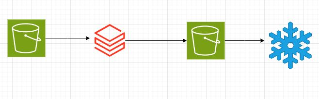

# Sparkify Mini Project
#### Ginamarie Mastrorilli
---
## Snowflake DDL Scripts
CREATE statements for each Target Table
```sql
CREATE TABLE ...
```

---
## Reference Architecture Diagram


---
## Sparkify's use of Data Lake & Data Warehouse
Discuss the purpose of the Data Lake, and Data Warehouse in context of the startup, Sparkify, and their analytical goals

---
## Database Schema & ETL Pipeline
State and justify your database schema design and ETL pipeline.

---
## Overall Process
Summarize your process